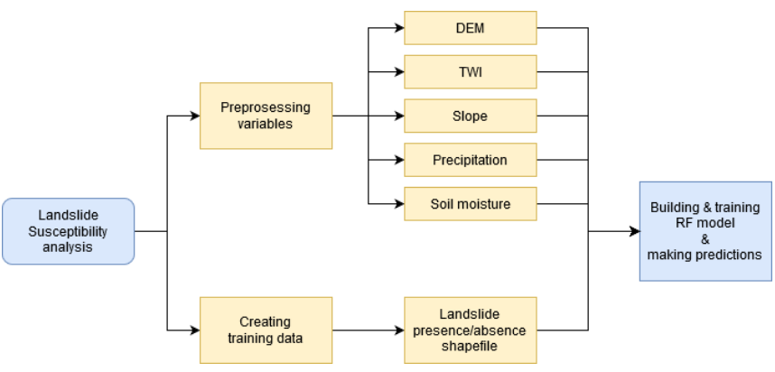
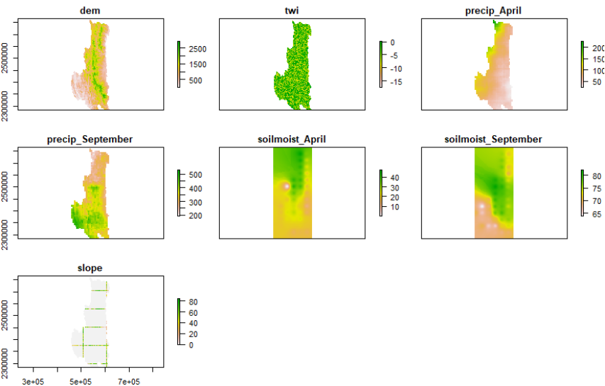
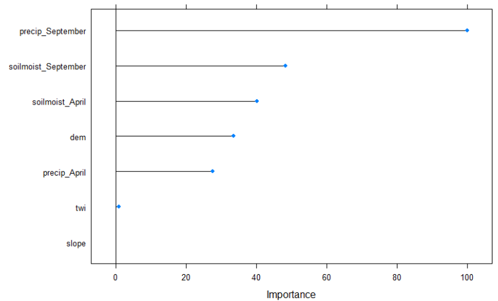
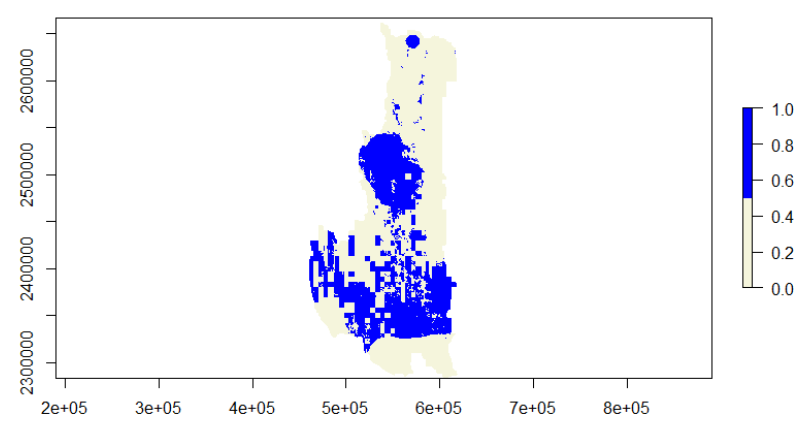

Landslide susceptibility analysis in West Myanmar using Random Forest
(RF) Machine Learning (ML) method
================
Irada Ismayilova

*In this tutorial you will explore the potential of RF method to predict
possible landslide prone areas. Used data and proposed workflow are for
the training purpose only and the results are not meant for the real
world application.*

## Data

For this task you are given the following data sets:

- Previous landslide locations in the study area (from NASA database)
- DEM
- TWI
- Soil moisture for April
- Soil moisture for September
- Precipitation for April
- Precipitation for September

You can download the mentioned data from here:
<https://mediastore.rz.uni-augsburg.de/get/c4PpWlfedr/>

## Getting started

As with any R project, we will start by importing required libraries.
Some of these libraries you have already used. However, there are new
packages that you have to install.

``` r
library("sp")
library("raster")
library("sf")
```

``` r
#install.packages()

library("dplyr") 
library("randomForest")
library("caret")
library("e1071")
```

Set the correct working directory and import the data. Note in this
tutorial we will only use **sp** package for working with shapefiles.

``` r
setwd("C:/GIS_for_env_applications/susceptibility")
```

``` r
#Load in all the required data

dem <- raster("dem.tif")
#twi <- 
#precip.A <- 
#precip.S <- 
#soil.moist.A <- 
#soil.moist.S <- 
```

For building a classification model, we require to have a binary
classification data set. In the case of landslides, a binary data set
will be e.g. a shapfile that shows locations where landslide occurred
(“1”) or did not occur (“0”). Locations can be both in the form of
points or polygons.

In this tutorial we have point locations where landslides occurred.
Using **QGIS** add the same number of points where landslides did not
occur (away from the given locations). Add a column to the shapefile and
assign value “1” to the landslide locations and value “0” to new “no
landslide” locations.

``` r
#read in landslides shapefile that contains landslide (1) and no landslide (0) information

landslides <- shapefile("landslides_training.shp")
```

## Analysis

In order to find out landslide susceptible areas, we will follow the
steps shown in the flowchart below.



Using DEM and previously learned skills, calculate slope. Slope will be
additional parameter involved into analysis.

``` r
#calculate slope

#slope <- 
```

We will further continue working with the raster stack rather than with
single rasters. “A RasterStack is a collection of RasterLayer objects
with the same spatial extent and resolution.” Using **stack** function
we can put all the rasters together.

``` r
rasStack <- stack(dem, twi, precip.A, precip.S, soil.moist.A, soil.moist.S, slope)
```

As always, check how the stacked layer looks like by plotting it.

``` r
#plot(rasStack)
```



For building classification model using all the variables, we have to
extract values of these variables for landslide/no landslide locations.
We can achieve this using **extract** function of the raster package.

``` r
rasValue <-extract(rasStack, landslides)
```

Rassvalue is a matrix that contains for each point location 7 columns
with corresponding raster values. Yet, it is missing the information if
the row represents landslide or no landslide location. But we can add it
using **cbind** function.

We further have to convert the matrix into a dataframe to make the next
steps easier, as well as add a column name to the landslide locations.

``` r
#add the landslide information

data <- cbind(rasValue, landslides$landslide)

#convert to a dataframe

data<- as.data.frame(data)

#add a column name to the column that contains 1 and 0

colnames(data)[8] <- 'landslide'
```

``` r
#explore the newly created dataframe

summary(data)

str(data)
```

As you can see, during the process numeric data is converted into
character which we have to change back to numeric. Easiest way to do so
is to use a **lapply** function

``` r
data[] <- lapply(data, function(x) as.numeric(as.character(x)))

str(data)

#now all the columns are of type numeric
```

## RF model

We prepared the data in a form that is acceptable by the RF model. We
should check if there are any NA’s in the dataframe. If there are any
they must be eliminated. How you should deal with the missing values
will depend on the task or on the typical approach in the applied
domain. In our case we will replace them with 0.

``` r
#prompt the sum of NA's in the dataframe

sum(is.na(data))

#convert them to 0

data[is.na(data)] <- 0
```

It is is possible to build both RF regression and classification model.
Since we have a binary classification task (landslide or no landslide)
it makes sense to use RF classification.

In R the type of the response column determines if it is a regression or
classification task. If the response column is numeric, then RF will
perform regression, if it is a factor then classification.

Therefore, we have to convert our response column to factors and
continue with the classification task.

``` r
#response column is the binary column

data$landslide <- as.factor(data$landslide)

str(data)
```

We can divide the data set into 2 parts. One part will be used for
training the mode, while the second one will be used to test the model.
The proportion of the each data set depends on the size of the data set,
task or preference. We can also set control parameters which will
control the model. In this tutorial we will use **Caret** package that
contains many different ML methods.

``` r
#set seed to make the results reproducible

set.seed(1234)

#Define the control

trControl <- trainControl(method = "cv",
                          number = 10,
                          search = "grid")
```

``` r
#divide data in 70/30 proportion for train/test data set

train <- sample(nrow(data), 0.7*nrow(data), replace = FALSE)

TrainSet <- data[train,]
ValidSet <- data[-train,]

#output the size of each data set
dim(TrainSet)
dim((ValidSet))
```

``` r
# Run the model

rf_default <- train(landslide~.,
                    data = TrainSet,
                    method = "rf",
                    metric = "Accuracy",
                    trControl = trControl)
```

``` r
# Print the results

print(rf_default)
```

Our trained model gives pretty good results. It is possible to play with
control parameters, size of the data set etc. to improve the results.

You can test the performance of the model using the test set.

``` r
prediction <-predict(rf_default, ValidSet)
```

We can use a confusion matrix (CM) to see how well the model performed
on the test data set. CM shows number of correct and incorrect
predictions of each class.

``` r
#request the confusion matrix to see how well classification worked

confusionMatrix(prediction, ValidSet$landslide)
```

We can also check which viable had the highest influence on the decision
making process of the model. Variable importance function can output us
importance of each variable.

``` r
#variable importance

imp <- varImp(rf_default)
plot(imp)
```



If you are satisfied with the accuracy of the model, you can use the
trained model and make prediction to the whole study area.

``` r
prediction <-predict(rasStack, rf_default)
```

Now you can plot the susceptibility map of the West Myanmar and save the
results.

``` r
plot(prediction)

rst <- writeRaster(prediction,"susceptibleAreas_areas.tif")
```


